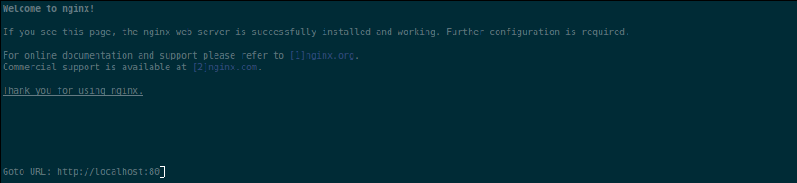
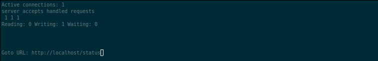

# Simple Docker
Introduction to docker. Developing a simple docker image for your own server.

## Part 1. Ready-made docker

Nginx is a lightweight and high-performance web server, proxy server, and reverse proxy server. It is designed to efficiently serve static and dynamic web content with low resource consumption and high reliability.

Nginx offers the following features and capabilities:
- Handling a large number of concurrent connections without significant overhead.
- Efficient processing of static content such as HTML, CSS, JS, and images.
- Advanced support for proxying and load balancing, allowing you to distribute traffic among multiple application servers.
- Built-in caching support to enhance performance and reduce load on backend servers.
- Security options and protection against attacks such as DoS attacks and availability attacks.
- Modularity, which allows adding additional functionality and extensions.

#### Take the official docker image from nginx and download it using docker pull.
> The `docker pull` command is used to pull (download) Docker images from a container registry. This command allows you to obtain images from various sources, such as Docker Hub or private registries, and store them locally on your machine.

#### Check for the docker image with docker images
> To list the Docker images that are available on your system, you can use the `docker images` command. This command will display a list of all the Docker images along with their respective details, such as repository, tag, image ID, creation date, and size.
To run the command, open a terminal or command prompt and enter the following:

#### Run docker image with docker run -d [image_id|repository]
> The `docker run -d` command is used to run a Docker container in detached mode. Detached mode means the container runs in the background without attaching the container's console to the terminal where the `docker run` command was executed.

#### Check that the image is running with docker ps

#### View container information with docker inspect [container_id|container_name]

#### Stop docker image with docker stop [container_id|container_name]

#### Check that the image has stopped with docker ps

#### Run docker with mapped ports 80 and 443 on the local machine with run command

#### Check that the nginx start page is available in the browser at localhost:80

#### Restart docker container with docker restart [container_id|container_name]

## Part 2. Operations with container

#### Read the nginx.conf configuration file inside the docker container with the exec command

#### Create a nginx.conf file on a local machine

#### Configure it on the /status path to return the nginx server status page

#### Copy the created nginx.conf file inside the docker image using the docker cp command

#### Restart nginx inside the docker image with exec

#### Check that localhost:80/status returns the nginx server status page

#### Export the container to a container.tar file with the export command

#### Stop the container

#### Delete the image with docker rmi [image_id|repository]without removing the container first

#### Delete stopped container

#### Import the container back using the importcommand
> The default parameters in the command `docker import -c 'CMD ["nginx", "-g", "daemon off;"]' container.tar` specify the default command that Docker will execute when running the imported container. In this case, the default parameters indicate Docker to run the    Nginx web server inside the container.

> Analyzing the default parameters presented in the command `CMD ["nginx", "-g", "daemon off;"]`, we can break them down into the following elements:

> 1. `["nginx"]`: This sets the executable file that Docker will run inside the container. In this example, it is set to Nginx.

> 2. `["-g", "daemon off;"]`: These are command-line arguments passed as parameters when executing the Nginx command. In this case, `-g` specifies a global configuration option, and `daemon off;` disables the Nginx daemon mode.

> In summary, these default parameters mean that when starting the Nginx container, Docker will execute the Nginx command with the specified arguments ("-g" and "daemon off;"), causing Nginx to run in the foreground (non-daemon mode) and use the specified global     configuration.

#### Run the imported container

#### Check that localhost:80/status returns the nginx server status page

## Part 3. Mini web server

#### Write a mini server in C and FastCgi that will return a simple page saying Hello World!
> `<fcgi_stdio.h>` is a header file from the FastCGI library that provides functions and macros for working with the FastCGI protocol. FastCGI is a language-independent protocol that allows a web server to communicate with a separate application or service to handle dynamic web content.

#### Write your own nginx.conf that will proxy all requests from port 81 to 127.0.0.1:8080
> `fastcgi_pass` is a configuration directive in the Nginx server's `nginx.conf` file that specifies where Nginx should forward FastCGI requests. It determines the address to which the FastCGI server expects connections to be made.

#### Run the written mini server via spawn-fcgi on port 8080

#### Check that browser on localhost:81 returns the page you wrote

#### Put the nginx.conf file under ./nginx/nginx.conf (you will need this later)

## Part 4. Your own docker

#### Write your docker file.

> script (bash) mini compile mini server

#### Build the written docker image with docker build, specifying the name and tag

> docker build -t "server name": "tag" . (dir)

#### Check with docker images that everything is built correctly

#### Run the built docker image by mapping port 81 to 80 on the local machine and mapping the ./nginx folder inside the container to the address where the nginx configuration files are located.

>   In the context of Docker, mapping refers to the process of connecting (mapping) a port or a directory inside a container to a port or directory on the host machine.
    Port mapping allows you to bind a container's port to a specific port on the host machine. For example, you can run a web server in a container listening on port 80 and map that port to port 8080 on the host. This way, when you access port 8080 on the host, the    traffic will be directed to port 80 inside the container.
    Directory mapping allows you to link a directory inside the container to a specific directory or path on the host machine. This enables file and data sharing between the container and the host. For example, you can map a local directory on the host to a directory  inside the container, so that the container has access to the files, or to store data generated within the container on the host.

> `-v $(pwd)/nginx:/path/inside/container` maps the local directory `./nginx` to the path inside the container.

#### Check that the page of the written mini server is available on localhost:80

#### Add proxying of /status page in ./nginx/nginx.conf to return the nginx server status

#### Check that localhost:80/status now returns a page with nginx status

