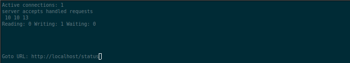

# Simple Docker
Introduction to docker. Developing a simple docker image for your own server.

## Part 1. Ready-made docker

Nginx is a lightweight and high-performance web server, proxy server, and reverse proxy server. It is designed to efficiently serve static and dynamic web content with low resource consumption and high reliability.

Nginx offers the following features and capabilities:
- Handling a large number of concurrent connections without significant overhead.
- Efficient processing of static content such as HTML, CSS, JS, and images.
- Advanced support for proxying and load balancing, allowing you to distribute traffic among multiple application servers.
- Built-in caching support to enhance performance and reduce load on backend servers.
- Security options and protection against attacks such as DoS attacks and availability attacks.
- Modularity, which allows adding additional functionality and extensions.

#### Take the official docker image from nginx and download it using docker pull.

#### Check for the docker image with docker images

#### Run docker image with docker run -d [image_id|repository]

#### Check that the image is running with docker ps

#### View container information with docker inspect [container_id|container_name]

#### Stop docker image with docker stop [container_id|container_name]

#### Check that the image has stopped with docker ps

#### Run docker with mapped ports 80 and 443 on the local machine with run command

#### Check that the nginx start page is available in the browser at localhost:80

#### Restart docker container with docker restart [container_id|container_name]

## Part 2. Operations with container

#### Read the nginx.conf configuration file inside the docker container with the exec command

#### Create a nginx.conf file on a local machine

#### Configure it on the /status path to return the nginx server status page

#### Copy the created nginx.conf file inside the docker image using the docker cp command

#### Restart nginx inside the docker image with exec

#### Check that localhost:80/status returns the nginx server status page

#### Export the container to a container.tar file with the export command

#### Stop the container

#### Delete the image with docker rmi [image_id|repository]without removing the container first

#### Delete stopped container

#### Import the container back using the importcommand
<! The default parameters in the command `docker import -c 'CMD ["nginx", "-g", "daemon off;"]' container.tar` specify the default command that Docker will execute when running the imported container. In this case, the default parameters indicate Docker to run the    Nginx web server inside the container.

Analyzing the default parameters presented in the command `CMD ["nginx", "-g", "daemon off;"]`, we can break them down into the following elements:

1. `["nginx"]`: This sets the executable file that Docker will run inside the container. In this example, it is set to Nginx.

2. `["-g", "daemon off;"]`: These are command-line arguments passed as parameters when executing the Nginx command. In this case, `-g` specifies a global configuration option, and `daemon off;` disables the Nginx daemon mode.

In summary, these default parameters mean that when starting the Nginx container, Docker will execute the Nginx command with the specified arguments ("-g" and "daemon off;"), causing Nginx to run in the foreground (non-daemon mode) and use the specified global     configuration. >

#### Run the imported container

#### Check that localhost:80/status returns the nginx server status page

## Part 3. Mini web server

####

####

####

####

####

####

